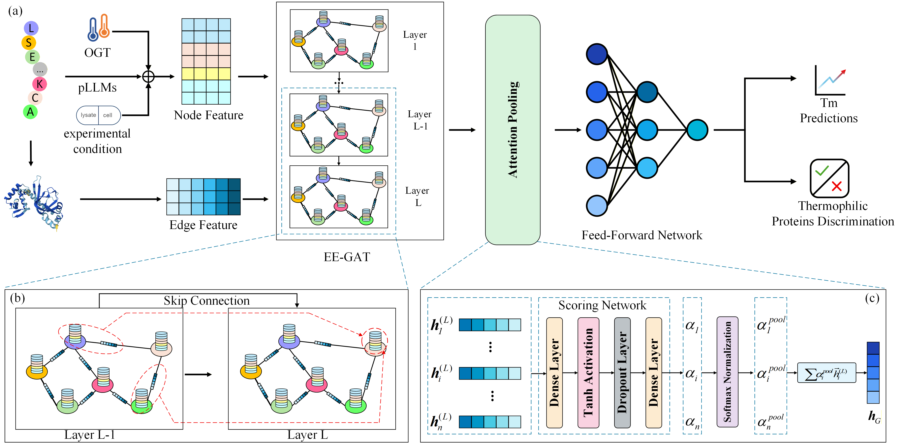

# GraphTM: Protein Thermal Stability Prediction (Binary Release)

GraphTM is a physics-aware graph attention network enhanced by multidimensional physicochemical edge features, designed to predict protein melting temperatures (Tm). This repository provides the pre-compiled standalone inference client for Linux systems, alongside our comprehensive benchmark datasets.

## Model Architecture

## Repository Structure

* **Dataset/**: Contains the benchmark datasets evaluated in our study.
* **input/**: A lightweight sample directory containing example `.pdb` structures, ESMC-600M `.npy` embeddings, and a `target_list.csv` to help you quickly test the executable.
* **assets/**: Contains static assets such as model architecture diagrams.

## Datasets Overview

We provide the complete datasets used for training and evaluating GraphTM:
* **DeepSTABp**: Primary benchmark for Tm prediction (30-97°C).
* **DeepTM-OGT & DeepTM-Tm50**: Benchmarks for Optimal Growth Temperature (OGT) and high-temperature predictions.
* **TmPred**: A low-homology dataset designed for evaluating robustness on extreme thermophilic proteins.
* **DeepTP & iThermo**: Datasets for thermophilic protein discrimination tasks, including balanced, unbalanced, and homology-specific subsets.

## System Requirements

* **Operating System**: Linux (Tested on Ubuntu/CentOS).
* **Memory (RAM)**: Minimum 16 GB recommended (to handle ESMC-600M feature processing and graph construction).
* **Dependencies**: None. The standalone binary encapsulates PyTorch, PyTorch Geometric, and all required model weights.

## Quick Start Guide

Since the fully compiled executable is too large for a standard Git repository, it is hosted on the Releases page. Please download `graphtm.bin` from the Releases page and place it in your project root directory before proceeding.

### 1. Grant Permissions

Ensure the downloaded binary has execution rights:

    chmod +x graphtm.bin

### 2. Run Inference

To avoid interference from system-wide libraries, clear the environment path before execution. The predictions will be saved automatically in a newly generated `output/` folder.

    # Clear system library path constraints
    export LD_LIBRARY_PATH=""

    # Execute the prediction client
    ./graphtm.bin --csv input/target_list.csv

### 3. Advanced Usage

GraphTM supports custom paths for input data and output directories. This is useful if your PDB or feature databases are stored in different locations.

    # Example of using custom paths
    ./graphtm.bin \
        --csv /path/to/your/list.csv \
        --pdb_dir /path/to/pdb_database \
        --esmc_dir /path/to/feature_database \
        --out_dir /path/to/custom_output

#### Parameters Description:

* **--csv**: Path to the target CSV file containing `uniprot_id`. (Default: `input/target_list.csv`)
* **--pdb_dir**: Directory containing the protein 3D structure files (.pdb). (Default: `input/pdb`)
* **--esmc_dir**: Directory containing the ESMC-600M sequence embedding files (.npy). (Default: `input/esmc_feat`)
* **--out_dir**: Directory where the prediction results and error logs will be saved. (Default: `output`)

## Input Format

The `target_list.csv` inside the `input/` folder must include the following columns:

* `uniprot_id`: The exact identifier matching your files in the `pdb/` and `esmc_feat/` directories.
* `ogt`: Optimal Growth Temperature (optional).
* `lysate` / `cell`: Experimental conditions (optional).
